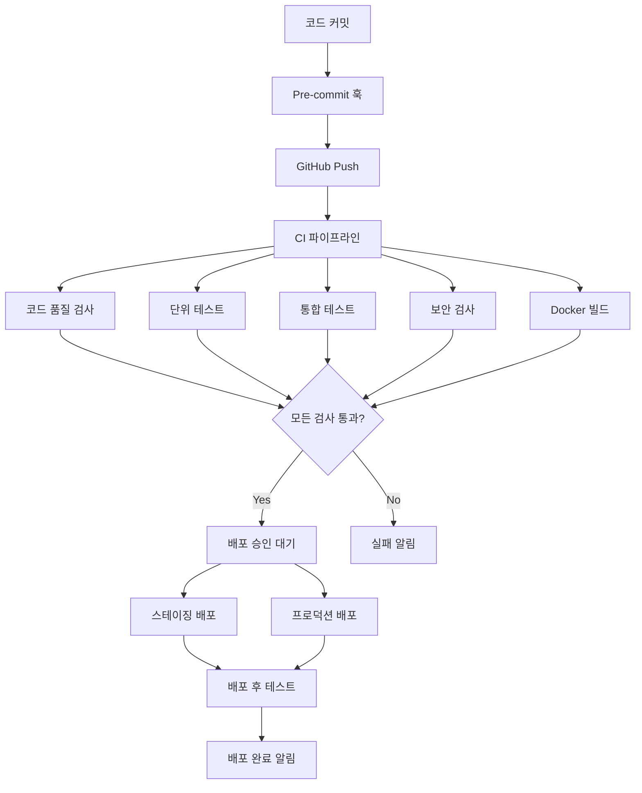

# CI/CD 파이프라인 가이드

전력시장 RAG 시스템의 지속적 통합 및 배포(CI/CD) 파이프라인에 대한 완전한 가이드입니다.

## 📋 목차

1. [개요](#개요)
2. [파이프라인 구조](#파이프라인-구조)
3. [GitHub Actions 워크플로우](#github-actions-워크플로우)
4. [로컬 개발 환경](#로컬-개발-환경)
5. [배포 프로세스](#배포-프로세스)
6. [보안 검사](#보안-검사)
7. [모니터링 및 알림](#모니터링-및-알림)
8. [문제 해결](#문제-해결)

## 개요

### CI/CD 파이프라인의 목적

- **품질 보장**: 자동화된 테스트를 통한 코드 품질 유지
- **보안 강화**: 자동화된 보안 검사로 취약점 조기 발견
- **배포 자동화**: 일관된 배포 프로세스로 인적 오류 최소화
- **빠른 피드백**: 개발자에게 즉각적인 피드백 제공

### 지원 환경

- **Development**: 개발자 로컬 환경
- **Staging**: 스테이징 서버 (develop 브랜치)
- **Production**: 프로덕션 서버 (main 브랜치, 릴리스 태그)

## 파이프라인 구조



## GitHub Actions 워크플로우

### 1. 메인 CI/CD 워크플로우 (`.github/workflows/ci.yml`)

#### 트리거 조건
```yaml
on:
  push:
    branches: [ main, develop ]
  pull_request:
    branches: [ main, develop ]
  release:
    types: [ published ]
```

#### 주요 작업
1. **코드 품질 검사**
   - Black (코드 포맷팅)
   - isort (import 정렬)
   - flake8 (린팅)
   - mypy (타입 힌트)
   - pylint (코드 품질)

2. **단위 테스트**
   - 다중 Python 버전 (3.8, 3.9, 3.10, 3.11)
   - 코드 커버리지 측정
   - Codecov 업로드

3. **통합 테스트**
   - PostgreSQL + Redis 서비스
   - 실제 환경과 유사한 테스트

4. **Docker 빌드**
   - 멀티 스테이지 빌드
   - 이미지 캐싱
   - 메타데이터 추출

### 2. 보안 검사 워크플로우 (`.github/workflows/security.yml`)

#### 보안 검사 항목
- **의존성 보안**: Safety 도구
- **코드 보안**: Bandit 정적 분석
- **컨테이너 보안**: Trivy 스캔
- **비밀 정보 검사**: TruffleHog
- **라이선스 검사**: pip-licenses

#### 주기적 스캔
```yaml
schedule:
  # 매주 월요일 오전 2시
  - cron: '0 2 * * 1'
```

## 로컬 개발 환경

### Pre-commit 훅 설정

```bash
# pre-commit 설치
pip install pre-commit

# 훅 설치
pre-commit install

# 모든 파일에 대해 실행
pre-commit run --all-files
```

### 로컬 테스트 실행

```bash
# 단위 테스트
pytest tests/ -v

# 커버리지 포함 테스트
pytest tests/ --cov=. --cov-report=html

# 특정 마커만 실행
pytest -m "not slow" tests/

# 통합 테스트만 실행
pytest -m integration tests/
```

### 코드 품질 검사

```bash
# 코드 포맷팅
black .
isort .

# 린팅
flake8 .
pylint **/*.py

# 타입 체크
mypy .

# 보안 검사
bandit -r .
safety check
```

## 배포 프로세스

### 자동 배포

#### 스테이징 배포
- **트리거**: `develop` 브랜치에 push
- **환경**: staging
- **승인**: 자동

#### 프로덕션 배포
- **트리거**: Release 발행
- **환경**: production
- **승인**: 수동 (GitHub Environment 보호 규칙)

### 수동 배포

#### 배포 스크립트 사용
```bash
# 스테이징 배포
./scripts/deploy.sh staging v1.0.0

# 프로덕션 배포
./scripts/deploy.sh production v1.0.0
```

#### Docker Compose 직접 사용
```bash
# 환경 설정
cp .env.example .env
# .env 파일 수정

# 서비스 시작
docker-compose up -d

# 로그 확인
docker-compose logs -f
```

### 배포 단계

1. **준비**
   - 환경 변수 설정
   - 필수 파일 확인
   - 의존성 확인

2. **백업** (프로덕션만)
   - 데이터베이스 백업
   - 설정 파일 백업

3. **빌드**
   - Docker 이미지 빌드
   - 이미지 태깅

4. **배포**
   - 기존 서비스 중지
   - 데이터베이스 마이그레이션
   - 새 서비스 시작

5. **검증**
   - 헬스 체크
   - 배포 후 테스트
   - 모니터링 확인

## 보안 검사

### 정적 분석 도구

#### Bandit
```bash
# 기본 실행
bandit -r .

# 설정 파일 사용
bandit -c pyproject.toml -r .

# 특정 취약점 제외
bandit -r . -s B101,B601
```

#### Safety
```bash
# 의존성 보안 검사
safety check

# JSON 형식 출력
safety check --json
```

### 컨테이너 보안

#### Trivy
```bash
# 파일시스템 스캔
trivy fs .

# Docker 이미지 스캔
trivy image power-market-rag:latest

# 심각도 필터링
trivy image --severity HIGH,CRITICAL power-market-rag:latest
```

### 동적 보안 테스트

#### OWASP ZAP
```bash
# 베이스라인 스캔
docker run -t owasp/zap2docker-stable zap-baseline.py \
  -t http://localhost:8000

# 전체 스캔
docker run -t owasp/zap2docker-stable zap-full-scan.py \
  -t http://localhost:8000
```

## 모니터링 및 알림

### CI/CD 메트릭

#### GitHub Actions
- 빌드 성공률
- 평균 빌드 시간
- 테스트 커버리지
- 보안 취약점 수

#### 모니터링 대시보드
```bash
# Prometheus 메트릭 확인
curl http://localhost:8000/monitoring/api/prometheus

# 대시보드 접근
open http://localhost:8000/monitoring
```

### 알림 설정

#### Slack 통합
```yaml
# GitHub Actions에서 Slack 알림
- name: Slack 알림
  uses: 8398a7/action-slack@v3
  with:
    status: success
    text: '배포 완료!'
  env:
    SLACK_WEBHOOK_URL: ${{ secrets.SLACK_WEBHOOK_URL }}
```

#### 이메일 알림
```yaml
# 실패 시 이메일 알림
- name: 실패 알림
  if: failure()
  uses: dawidd6/action-send-mail@v3
  with:
    server_address: smtp.gmail.com
    server_port: 587
    username: ${{ secrets.MAIL_USERNAME }}
    password: ${{ secrets.MAIL_PASSWORD }}
    subject: 'CI/CD 파이프라인 실패'
    body: '빌드가 실패했습니다.'
    to: admin@company.com
```

## 문제 해결

### 일반적인 문제

#### 1. 테스트 실패
```bash
# 상세 로그 확인
pytest tests/ -v -s

# 특정 테스트만 실행
pytest tests/test_api.py::TestAuthenticationAPI::test_login_valid_user -v

# 디버그 모드
pytest tests/ --pdb
```

#### 2. Docker 빌드 실패
```bash
# 캐시 없이 빌드
docker build --no-cache -t power-market-rag .

# 빌드 컨텍스트 확인
docker build --progress=plain -t power-market-rag .

# 멀티 스테이지 특정 단계까지만
docker build --target development -t power-market-rag:dev .
```

#### 3. 환경 변수 문제
```bash
# 환경 변수 확인
docker-compose config

# 컨테이너 내부 환경 변수
docker-compose exec app env

# .env 파일 구문 검사
docker-compose config --quiet
```

#### 4. 네트워크 연결 문제
```bash
# 컨테이너 네트워크 확인
docker network ls
docker network inspect power-market-rag_default

# 포트 사용 확인
netstat -tulpn | grep :8000
```

### 로그 분석

#### 애플리케이션 로그
```bash
# 실시간 로그 확인
docker-compose logs -f app

# 특정 시간 이후 로그
docker-compose logs --since="1h" app

# 에러 로그만 필터링
docker-compose logs app | grep -i error
```

#### 시스템 로그
```bash
# 시스템 리소스 확인
docker stats

# 컨테이너 상태 확인
docker-compose ps

# 볼륨 사용량 확인
docker system df
```

### 성능 최적화

#### 빌드 시간 최적화
```dockerfile
# .dockerignore 활용
echo "node_modules" >> .dockerignore
echo ".git" >> .dockerignore
echo "*.log" >> .dockerignore

# 멀티 스테이지 빌드
FROM python:3.9-slim as base
# ... 기본 의존성

FROM base as development
# ... 개발 의존성

FROM base as production
# ... 프로덕션 설정
```

#### 테스트 병렬화
```yaml
# GitHub Actions 매트릭스 전략
strategy:
  matrix:
    python-version: ['3.8', '3.9', '3.10', '3.11']
    test-group: [unit, integration, api]
```

#### 캐시 활용
```yaml
# 의존성 캐시
- name: 의존성 캐시
  uses: actions/cache@v3
  with:
    path: ~/.cache/pip
    key: ${{ runner.os }}-pip-${{ hashFiles('**/requirements.txt') }}
```

## 모범 사례

### 1. 브랜치 전략
- **main**: 프로덕션 준비 완료 코드
- **develop**: 개발 통합 브랜치
- **feature/**: 기능 개발 브랜치
- **hotfix/**: 긴급 수정 브랜치

### 2. 커밋 메시지
```
feat: 새로운 기능 추가
fix: 버그 수정
docs: 문서 수정
style: 코드 포맷팅
refactor: 코드 리팩토링
test: 테스트 추가/수정
chore: 빌드/설정 수정
```

### 3. 릴리스 관리
```bash
# 시맨틱 버전 사용
v1.0.0  # 메이저 릴리스
v1.1.0  # 마이너 릴리스
v1.1.1  # 패치 릴리스

# 태그 생성
git tag -a v1.0.0 -m "Release version 1.0.0"
git push origin v1.0.0
```

### 4. 환경 분리
```bash
# 환경별 설정 파일
.env.development
.env.staging
.env.production

# 환경별 Docker Compose
docker-compose.yml          # 기본 (프로덕션)
docker-compose.dev.yml      # 개발
docker-compose.staging.yml  # 스테이징
```

## 추가 리소스

### 문서
- [GitHub Actions 문서](https://docs.github.com/en/actions)
- [Docker 문서](https://docs.docker.com/)
- [pytest 문서](https://docs.pytest.org/)

### 도구
- [pre-commit](https://pre-commit.com/)
- [Black](https://black.readthedocs.io/)
- [Bandit](https://bandit.readthedocs.io/)
- [Trivy](https://aquasecurity.github.io/trivy/)

### 모니터링
- [Prometheus](https://prometheus.io/)
- [Grafana](https://grafana.com/)
- [Sentry](https://sentry.io/)

---

이 CI/CD 파이프라인을 통해 안정적이고 보안이 강화된 전력시장 RAG 시스템을 구축할 수 있습니다.